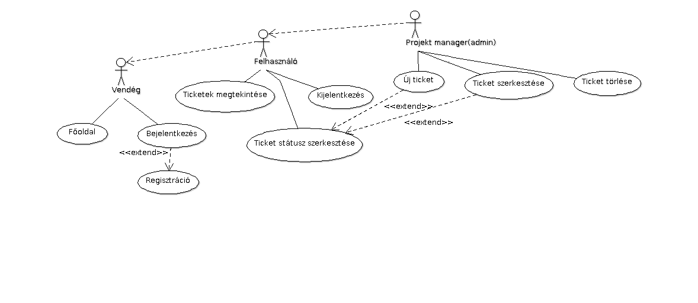

# Alkalmazások fejlesztése 1. beadandó

Téma: Ticket rendszer

Felhasználók:
	admin user: Felhasználó név: root pass: root

## Követelmény-analízis

### Követelmények
- #### Funkcionális elvárások
	- Látogatóként regisztráció
	- Látogatóként bejelentkezés
	- Felhasználóként a feladatok megtekintése
	- Felhasználóként feladat kiírása
	- Felhasználóként feladat szerkesztése
	- Adminként(projekt manager) feladat törlése
	- Főoldalon az alkalmazás ismertetése

- #### Nem-funkcionális elvárások
    - Ergonómikus elrendezés
    - Hatákonyság működés
    - Biztonságos működés: jogosultságok ellenőrzése, jelszavak biztonságos tárolása

### Használatieset-modell

- #### Szerepkörök
    1. Vendég
		- főoldal megtekintése
		- bejelentkezés
		- regisztráció
        
    2. Felhasználó
		- vendég szerepköre
		- ticketek megtekintése
		- neki szánt ticket státuszának módosítása

    3. Admin
        	- felhasználó szerepköre
		- új ticket létrehozása
		- ticket szerkesztése
		- ticket törlése

- #### Használatieset diagram
      

- #### Folyamatok pontos menete
    1. Új ticket 
    2. Ticket szerkesztése 
    3. Ticket törlés 
    4. Ticket status szerkesztés 

## Tervezés

### Architektúra terv
- #### Oldaltérkép
	- **Publikus:**
	    - Főoldal
	    - Bejelentkezés
	    - Regisztráció
	    
	- **Bejelentkezve:**
	    - Főoldal
	    - Kijelentkezés
	    - Ticketek listája
	        + új ticket
	        + ticket szerkesztése
		+ status szerkesztése
	        + ticket törlése (adminként)

- #### Végpontok
    - GET /: főoldal
    - GET /login: bejelentkezés
    - POST /login: bejelentkezési adatok feldolgozása
    - GET /logout: kijelentkezés
    - GET /signup: regisztráció
    - POST /signup: regisztrációs adatok feldolgozása
    - GET /tickets/list: ticketek listázása
    - GET /tickets/new: új ticket létrehozása
    - POST /tickets/new: új ticket feldolgozása
    - GET /tickets/edit/id: ticket szerkesztése
    - POST /tickets/edit/id: szerkesztett adat feldolgozása
    - GET /tickets/status/id: ticket status szerkesztése
    - POST /tickets/status/id: ticket status feldolgozása
    - GET /tickets/delete/id: ticket törlése

### Felhasználóifelület-modell
- #### Oldalvázlatok
    - Főoldal
        
    - Bejelentkezés
        
    - Regisztráció
        
    - Ticketek
        
    - Új feladat
        

### Adatbázisterv

